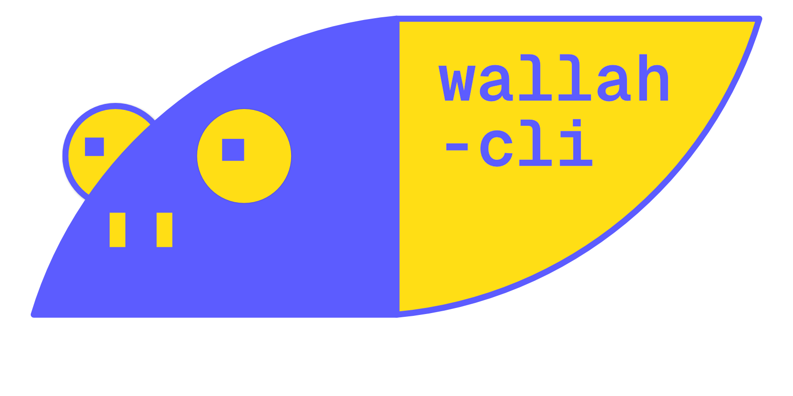

<div align="center">

</div>

wallah-cli is a CLI which you can change your macOS wallpaper, in which the menu bar part is black, in order to hide that ugly notch. Furthermore it is less distracting if you have auto-hide the menu bar.

It is a minimal alternative to app [Top Notch](https://topnotch.app/), and it is inspired by [removethenotch](removethenotch.com).

### Installation

You need to have Go installed. This command will compile and install the CLI tool in your system PATH.
```sh
go install github.com/stonkol/wall-cli@latest
```

If it is installed correctly this will set your wallpaper to blue:
```sh
wallah blue
```

## Index

1. [Build yourself](#1-build-yourself)
2. [Colors included](#2-colors-included)
3. [Having issues?](#3-having-issues)
4. [How it works](#4-how-it-works)
5. [Roadmap](#5-roadmap)
6. [Contributing](#6-contributing)

---

## 1. Build yourself

### 1.1 Build the Binary

Compile all the go files:
```sh
go build
```

> [!caution] Caution
> Don't use `wall` or other name that is used for a standard Unix/Linux command.

### 1.2 Move the Binary

Move the binary to a directory in your PATH, to run the app globally:
```sh
sudo mv wallah /usr/local/bin/
sudo chmod +x /usr/local/bin/wallah # make the file executable
```

### 1.3 Try it out

```sh
wallah -v        # show version
wallah -h        # show help
wallah -l        # show list of colors available
wallah blue      # set blue (#0000EE)
wallah blue-b    # set bright blue (#5C5CFF)
wallah pikachu   # set pikachu color (#F8A21C)
```

1. macOS may requires explicit permission for apps (including Terminal or the compiled CLI binary) to change the wallpaper.
1. macOS may ask to accept permissions the first time your run the application.

## 2. Colors included

Example of one of the wallpapers (bright blue):

<div align="center">

</div>

### 2.1 ANSI 16

The basic 8 colors, by default is the dark mode version. Add `b-` prefix for bright(light) versions (`b-blue`).

`black`, `red`, `green`, `yellow`, `blue`, `magenta`, `cyan` and `white`.

<div align="center">

</div>

### 2.2 CHAR 16

Based on 8 famous characters, each with their own light and dark mode. Add `b-` prefix for bright(light) versions (`b-pikachu`).

`pikachu`, `akira`, `stitchy`, `yoshi`, `blender`, `kirby`, `teddy`, `wario`.

<div align="center">

</div>

## 3. Having issues

#### 3.1 Only changed on one deskptop?

On newer macOS versions (Ventura, Sonoma), wallpaper management changed:
The wallpaper might only change on the current desktop/space.
You might need to set wallpaper for each desktop separately.

#### 3.2 Running the AppleScript manually

Test the AppleScript works with your wallpaper manually in the Terminal:
```sh
osascript -e 'tell application "System Events" to set picture of every desktop to POSIX file "/absolute/path/to/image.jpg"'
```

#### 3.3 Run the command as the logged-in user

If you run your Go program as root or via sudo, the AppleScript may run as root and fail to change the wallpaper for the logged-in user.
Make sure you run the CLI as the current logged-in user.

## 4. How it works

- Using `osascript` command to change the color of the wallpaper on macOS.
- It runs AppleScript from Go using `os/exec` package.
- All the default wallpapers are located in the `wallpapers` directory.
- There is a `design-files` directory with the design files (`.psd` and `.afdesign`) used to create the wallpapers. In which you can use to create your own wallpapers, either with solid colors, gradients, or an image.

## 5. Roadmap

- The wallah CLI to change wallpapers.
    - [x] --help flag
    - [x] --list flag
    - [ ] Have colored text on the CLI
    - [ ] Let users change the path of the wallpapers
    - [ ] Let users users set the wallpaper for dark mode and light mode, which will change according to the system settings.
    - [ ] include a `-d` `--dark` and `-l` `--light` flags for toggling mode
    - [ ] Let user enable/disable auto-light/dark mode.

- [x] make a logo to put on the top of the README on Github

- [ ] dark mode script
    - a script to change the color of the wall according to system settings.
    - let the user setting if

- Add other versions
    - [ ] Include the 16 [ANSI colors](https://en.wikipedia.org/wiki/List_of_software_palettes)
    - [ ] 16" MBP version.
    - [ ] 13" and 15" MacBook Air
    - [ ] Colors of 8 Characters

## 6. Contributing

Welcome to make a pull request or add an issue, but before please read the README.md before contributing. 😀
