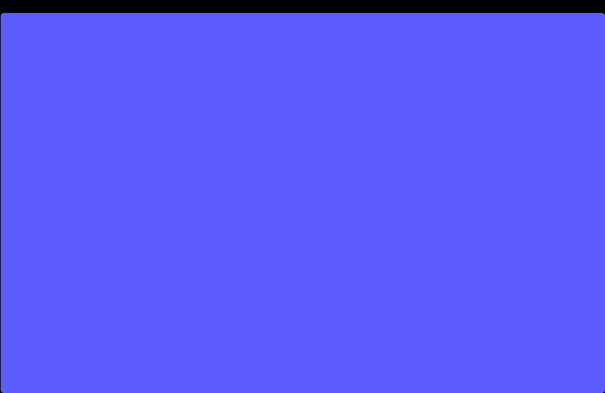
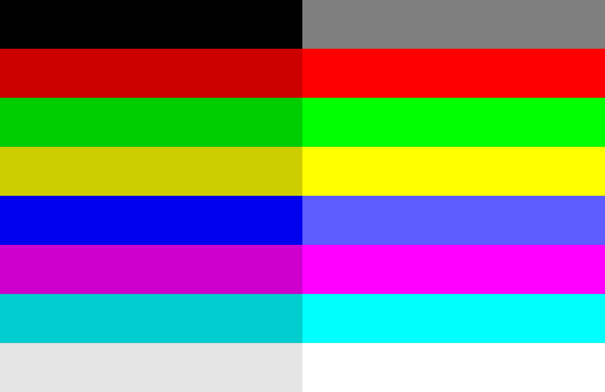
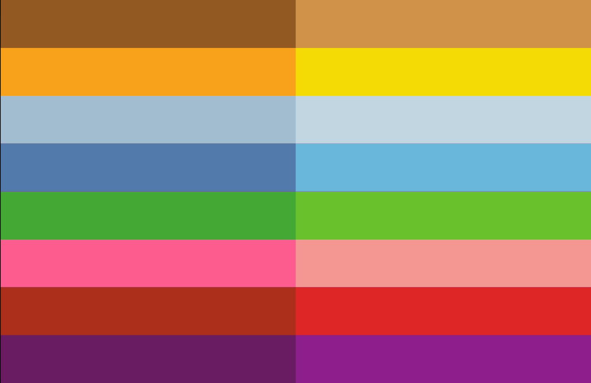

# wall-cli

A Wallpaper CLI for removing the top notch and rounding the corners. The minimal alternative to app [Top Notch](https://topnotch.app/). Inspired by [removethenotch](removethenotch.com). A none-resource-consuming, app-free, zero-dependency CLI.

You also can adjust your own colors or put your own images on the

A CLI app for changing the color of your wallpaper.

## Index

1. [Usage](<README#1. Usage>)
2. [Colors included](<README#2. Colors included>)
3. [Having issues?](<README#3. Having issues?>)
4. [How it works](<README#4. How it works>)
5. [Roadmap](<README#5. Roadmap>)
6. [Contributing](<README#6. Contributing>)

## 1. Usage

### Build the Binary

Build it (in your project directory run):
```sh
go build -o wall # compiles the Go code into an executable named wall
```

### Move the Binary

Move the binary to a directory in your PATH, to run the app globally:
```sh
sudo mv wall /usr/local/bin/
sudo chmod +x /usr/local/bin/wall # make the file executable
```

### Try it out

```sh
wall -v        # show version
wall -h        # show help
wall -l        # show list of colors available
wall blue      # set blue (#0000EE)
wall blue-b    # set bright blue (#5C5CFF)
wall pikachu   # set pikachu color (#F8A21C)
```

1. macOS may requires explicit permission for apps (including Terminal or the compiled CLI binary) to change the wallpaper.
1. macOS may ask to accept permissions the first time your run the application.

## 2. Colors included

Example of one of the wallpapers (bright blue):

<div align="center">

</div>

### ANSI 16

The basic 8 colors, by default is the dark mode version:
`black`, `red`, `green`, `yellow`, `blue`, `magenta`, `cyan`, `white`.

If you want their bright versions add an "b-":
`b-black`, `b-red`, `b-green`, `b-yellow`, `b-blue`, `b-magenta`, `b-cyan`, `b-white`.

<div align="center">

</div>

### CHAR 16

Based on 8 famous characters, each with their own light and dark mode.

`pikachu`, `charmander`, `stitchy`, `yoshi`, `blender`, `kirby`, `teddy`, `wario`.

<div align="center">

</div>

## 3. Having problems?

#### Only changed on one deskptop?

On newer macOS versions (Ventura, Sonoma), wallpaper management changed:
The wallpaper might only change on the current desktop/space.
You might need to set wallpaper for each desktop separately.

#### Running the AppleScript manually

Test the AppleScript works with your wallpaper manually in the Terminal:
```sh
osascript -e 'tell application "System Events" to set picture of every desktop to POSIX file "/absolute/path/to/image.jpg"'
```

#### Run the command as the logged-in user

If you run your Go program as root or via sudo, the AppleScript may run as root and fail to change the wallpaper for the logged-in user.
Make sure you run the CLI as the current logged-in user.

## 4. How it works

- Using `osascript` command to change the color of the wallpaper on macOS.
- It runs AppleScript from Go using `os/exec` package.
- All the default wallpapers are located in the `wallpapers` directory.
- There is a `design-files` directory with the design files (`.psd` and `.afdesign`) used to create the wallpapers. In which you can use to create your own wallpapers, either with solid colors, gradients, or an image.

## 5. Roadmap

- The wall CLI to change wallpapers.
    - [x] --help flag
    - [x] --list flag
    - [ ] Have colored text on the CLI
    - [ ] Let users change the path of the wallpapers
    - [ ] Let users users set the wallpaper for dark mode and light mode, which will change according to the system settings.
    - [ ] include a `-d` `--dark` and `-l` `--light` flags for toggling mode
    - [ ] Let user enable/disable auto-light/dark mode.

- [ ] make a logo to put on the top of the README on Github

- [ ] dark mode script
    - a script to change the color of the wall according to system settings.
    - let the user setting if

- Add other versions
    - [ ] Include the 16 [ANSI colors](https://en.wikipedia.org/wiki/List_of_software_palettes)
    - [ ] 16" MBP version.
    - [ ] 13" and 15" MacBook Air
    - [ ] Colors of 8 Characters

## 6. Contributing

Welcome to make a pull request or add an issue, but before please read the README.md before contributing. 😀
